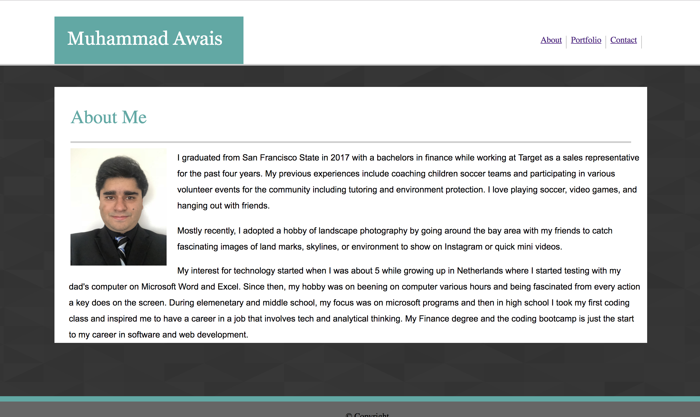

# Basic-Portfolio

Learning html, css, floats, positioning, box model, links, images, style, background

# Link to deployed site

[Basic-Portfolio](https://mawais54013.github.io/Basic-Portfolio/)

# Images


# Technology Used
- HTML
- CSS

# Code Snippets

```
<title>Portfolio</title>
        <link rel="stylesheet" href="../Basic-Portfolio/assets/css/reset.css">
        <link rel= "stylesheet" href="../Basic-Portfolio/assets/css/style.css">
```
# Author 
[Muhammad Awais](https://github.com/mawais54013/HW-Wireframe)